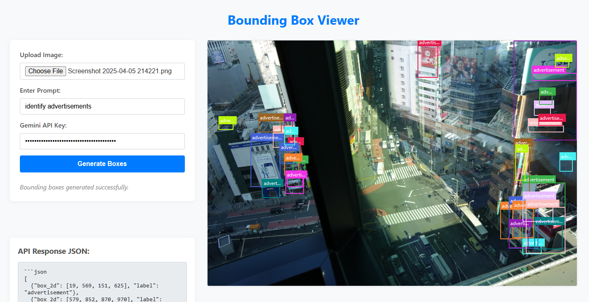

# Gemini Bounding Box Viewer

A simple web-based tool to demonstrate the vision capabilities of Google's Gemini API.

Upload an image, provide a prompt (e.g., "identify all cars"), enter your Gemini API key, and click "Generate Boxes". The tool will call the Gemini API and display the resulting bounding boxes overlaid on your image.

## Example

## How to Use
1.  Open `index.html` in your web browser.
2.  Upload an image.
3.  Enter a prompt.
4.  Enter your Google Gemini API Key.
5.  Click "Generate Boxes".