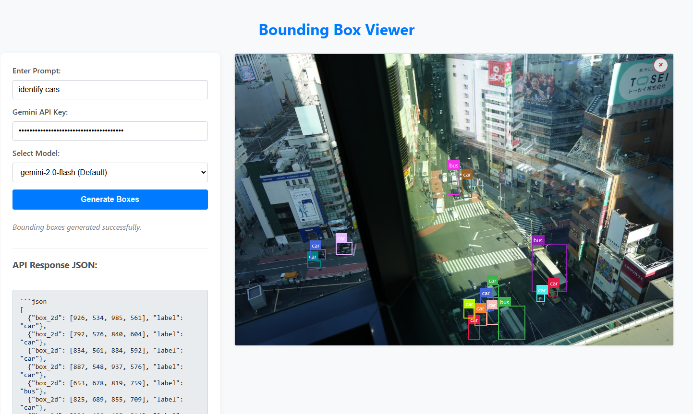
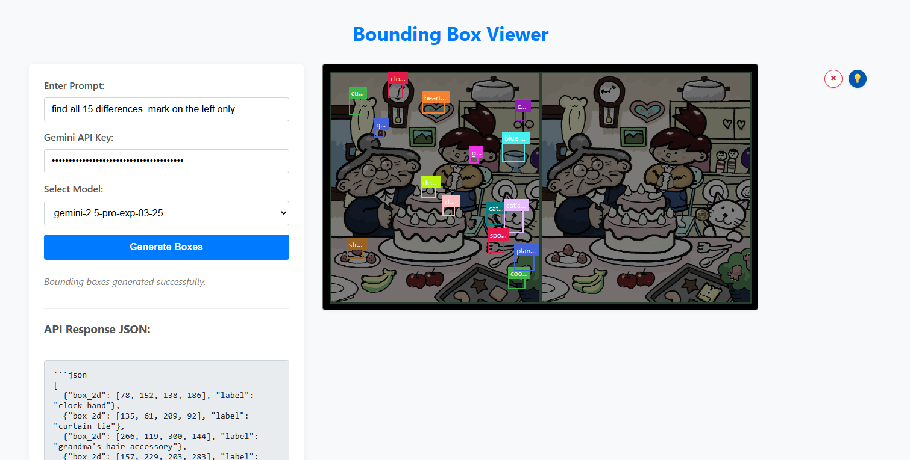

# Gemini Bounding Box Viewer

Single HTML tool to demonstrate the vision capabilities of Google's Gemini API by. This tool only connects to Google Gemini API directly and does not store / track anything.

Upload an image, provide a prompt (e.g., "identify all cars"), enter your Gemini API key, and click "Generate Boxes". The tool will call the Gemini API and display the resulting bounding boxes overlaid on your image.

## Example

Below is an example of Gemini 2.0 Flash model identifying cars.

Image taken in Japan by myself

This example is Gemini 2.5 Pro (experimental) model completing a find the difference puzzle.

Original image from [wikimedia](https://commons.wikimedia.org/wiki/File:Spot_the_difference.png) attributed to [Muband](https://en.wikipedia.org/wiki/ja:User:Muband)

## How to Use
1.  Open `index.html` in your web browser.
2.  Upload an image.
3.  Enter a prompt.
4.  Enter your Google Gemini API Key.
5.  Click "Generate Boxes".